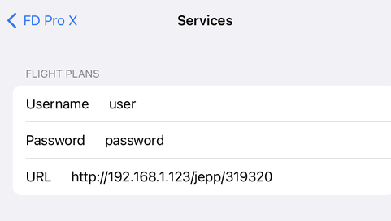
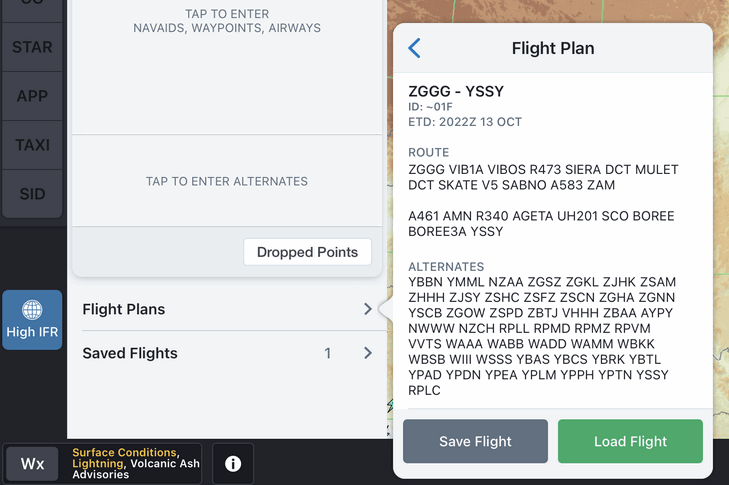

## JeppFD-Pro 或 FliteDeckPro 配置说明  
* 如果数据库中有敏感的航线数据，请注意使用范围。   
* 在 ipad 自带的系统设置 "设置"   
  * 在左侧找到 "FD Pro" 或 "FD Pro X"   
  * ACCOUNT INFO "Services"   

|    | FLIGHT PLANS |   |
|-----|---|----- |
| Username:	| 根据数据库 user 表的账号填写 |
| Password:	| 根据数据库 user 表的密码填写 |
| URL:	| http://192.168.1.123:8080/jepp/733738/ |	提供733和738的备降场列表 |
|   | http://192.168.1.123:8080/jepp/330/       |	提供330的备降场列表 |
|   | http://192.168.1.123:8080/jepp/319320321/ |	提供320系列的备降场列表 |
|   | http://192.168.1.123:8080/jepp/           |	不考虑机型的备降场列表 |
|   | http://192.168.1.123:8080/jepp/000/       |	不提供备降场列表 |
|   | 支持的机型 (根据数据库中的内容决定)       |       |
|   | 注意，**URL中,前后不能有空格**             |       |

* * 设置完成, 退出"设置".   
* 打开 FD Pro 或者 FD Pro X ,   
  * 找到 "Flight Plans"。   
  * 在"Call sign"位置,输入ICAO或IATA机场对 **(不能包含空格)**。   
  比如: CANSYD 或 ZGGGYSSY (能查询/获取的航线, 根据数据库中的内容决定)   
  * 就能看到航路计划了。   
 
 
 
------
## 服务程序，golang版，见【[golang-bin](golang-bin)】  
## 服务程序，rust版，见【[rust-bin](rust-bin)】  
## Download下载 golang,rust版，见【[releases](https://github.com/osnosn/jeppFlightPlan/releases)】  

